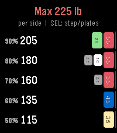
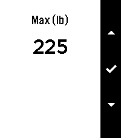
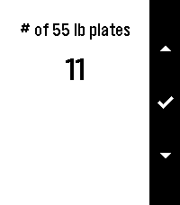

# pl8s ("plates")

A minimalist barbell percentage + plate calculator for Pebble, written in C.

Enter your training max for an exercise and pl8s shows descending percentages with the exact weight to load and a glyph of the plates needed **per side** (default 90..50 in 10% steps, or 90..60 in 5% steps — selectable in settings). Large color displays (Pebble Time 2 / agate) draw each plate as a thick disc with the weight printed horizontally in bold on its face and a gym-standard color per size (55 red, 45 blue, 35 yellow, 25 green, 15 pink, 10 white, 5 cyan, 2.5 grey); compact displays keep the thin side-view bars.



## Features

- **Percentage rows** with the loadable weight and per-side plate glyphs (bold horizontal weight labels on large color displays). Default 10% step shows 90..50; switch to **5% steps** in settings to see 90, 85, 80, 75, 70, 65, 60 (7 rows)
- **Max entry**: UP/DN nudge the max in 5 lb steps (hold to repeat), SELECT opens a NumberWindow for direct entry (45-995 lb); confirming ✓ returns to the results
- **Settings wizard** (hold SELECT): first set the percent step (5% or 10%), then step through each plate size (55/45/35/25/15/10/5/2.5 lb) and set how many the gym has, 0-10 per side. 10 means unlimited - the default
- **Phone settings page**: the Pebble/Rebble phone app shows a gear icon next to pl8s (the app declares `capabilities: ["configurable"]`); tapping it opens a hosted webpage with the same settings, and saves push them to the watch over AppMessage. The watch keeps the on-device wizard too
- **Always loadable weights**: percentages are snapped to the nearest weight the configured inventory can build exactly. With unlimited plates every 2.5 lb step is reachable; with a limited inventory the weight snaps DOWN to the heaviest buildable weight, never showing a load you can't make
- **Backlight stays on** while the app is in the foreground (returns to automatic control on exit); the user-facing "backlight timeout" watch setting (`Settings > Display > Backlight`) is a separate system control
- **Persistent**: max, percent step, and plate counts survive app exit
- 45 lb Olympic bar assumed

## Screenshots

|                                   |                                          |
|-----------------------------------|------------------------------------------|
|  |    |
| Max entry (NumberWindow)          | Settings wizard (hold SEL): percent step |

## Phone settings page

The config page is a single self-contained file: [`config.html`](config.html). It must be hosted at an http (s) URL the phone can open — the page location is set in `src/pkjs/index.js` (`CONFIG_URL`):

```js
var CONFIG_URL = 'https://cmalec.github.io/pl8s/config.html';
```

GitHub Pages works out of the box for this repo. The page talks to the watch via the standard Pebble config protocol, and it mirrors
**everything the on-watch settings wizard can change** — percent step, exercise
max, and per-plate counts — prefilled with the current values:

1. The watch pushes its current settings when asked: `src/pkjs/index.js` sends a
   `SYNC` AppMessage on JS ready and on every gear tap; `src/c/main.c` replies
   with `STEP`, `MAX_LB`, and all `PLATE_*` values. The JS side caches them in
   localStorage and appends them to the config URL as query params.
2. The phone app's gear fires `showConfiguration`, which opens
   `CONFIG_URL + '?step=..&max=..&p55=..&p2p5=..'`; `config.html` prefills the
   form from those params.
3. Save redirects to `pebblejs://close#<json>`; the phone decodes it and fires `webviewclosed` with the settings.
4. `src/pkjs/index.js` forwards them to the watch with `Pebble.sendAppMessage`, keyed by the `messageKeys` in `package.json` (`STEP`, `MAX_LB`, `PLATE_*`).
5. `src/c/main.c` (`inbox_received_handler`) validates, persists, and redraws.

The watch-only wizard (hold SEL) and the phone page can be used interchangeably;
the watch pushes its state after the wizard closes too, so the page always opens
showing current values.

Message keys are shared between the C build (`MESSAGE_KEY_*` from
`build/include/message_keys.auto.h`) and the JS runtime (`message_keys.json`), both generated from `messageKeys` in `package.json`.

## Building & running

```sh
pebble login
pebble build                          # build for all targetPlatforms
pebble install --emulator emery       # install on the emery emulator
pebble install --cloudpebble          # install to a paired phone
npm test                              # host unit test of the plate math
npm run test:emulator                 # drive the wizard on the emulator
```

Testing phone-side pushes from the emulator. `--int` takes the numeric message
keys the SDK assigns, listed in `build/js/message_keys.json` after a build, and
all pairs go after one `--int`:

```sh
pebble send-app-message --emulator emery --int 10000=5            # STEP
pebble send-app-message --emulator emery --int 10001=315 10009=3  # MAX_LB, PLATE_2P5
```

## Target platforms

Built for **emery** (Pebble Time 2) first, with layout adaptations for the smaller rect displays (basalt/diorite/flint/aplite) and round displays (chalk/gabbro). Round large displays (gabbro) may crop the outer corners of the bottom row to the circular mask.

## Project layout

```
src/c/           C source for the watchapp (plate_math.c is SDK-free: math only)
src/pkjs/        Phone-side JavaScript (config page bridge)
config.html      Self-contained phone settings page (host it on GitHub Pages)
tools/           Host unit test (C), emulator test + screenshot OCR (Python)
resources/       Images, fonts, and other bundled resources
package.json     Project metadata (UUID, platforms, resources, message keys)
wscript          Build rules - usually no need to edit
```

## Testing

The plate math is plain C with no Pebble SDK dependency, so it is unit tested
on the host against the same source the watchapp links:

```sh
npm test
```

`tools/test_plate_math.c` compares every row against an independent oracle (a
memoized exhaustive search over plate multisets, deliberately a different
algorithm from the app's reachable-load bitset) across the whole max range,
both step modes, curated and random limited inventories, and every inventory
with 0..2 of each size. It also pins the plates the glyph draws, and the rows
that a limited inventory has to snap down.

The app itself only really runs on the watch, so the wizard, persistence and
rendering are checked on the emulator:

```sh
pebble build
npm run test:emulator
```

That restarts the emery emulator, drives the settings wizard with button
presses and reads the weights back off the screen with `tools/ocr_weights.py`,
so a wrong weight fails the run instead of just changing the picture.

## Documentation

Full SDK docs, tutorials, and API reference: <https://developer.repebble.com>